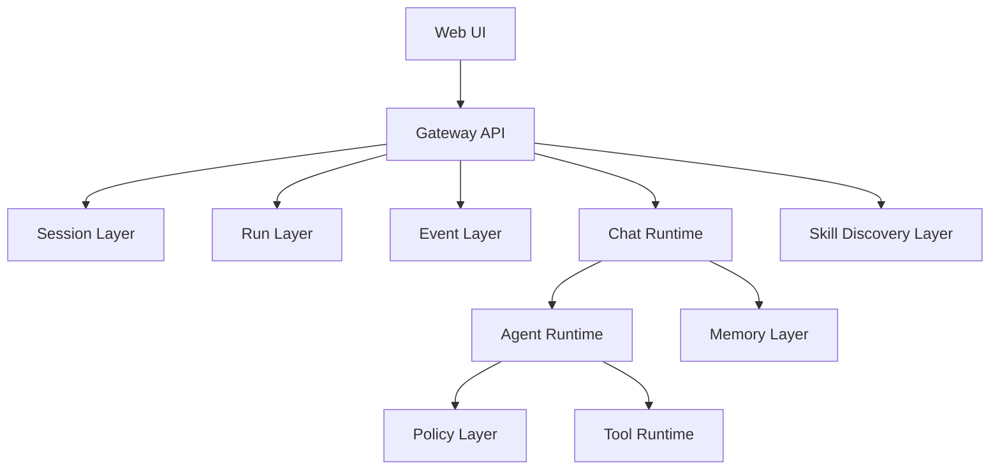
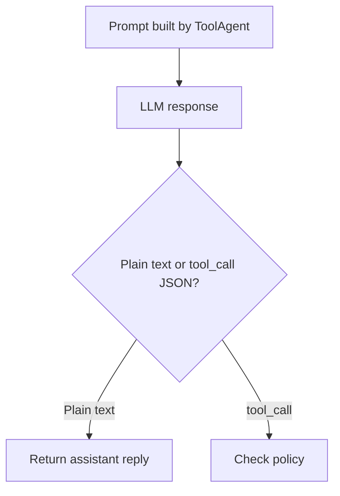
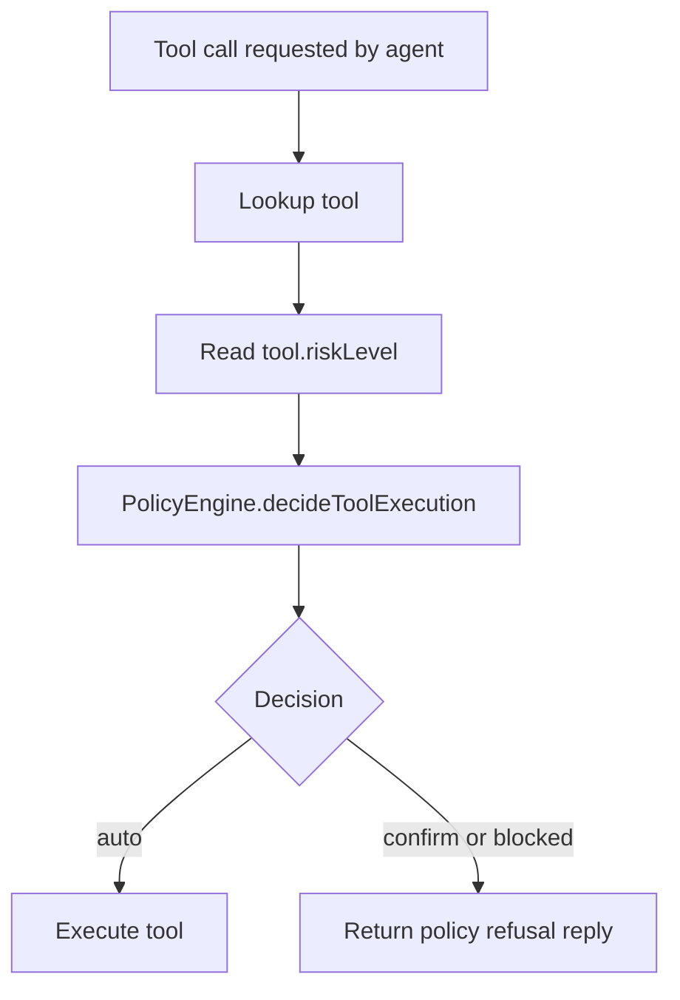
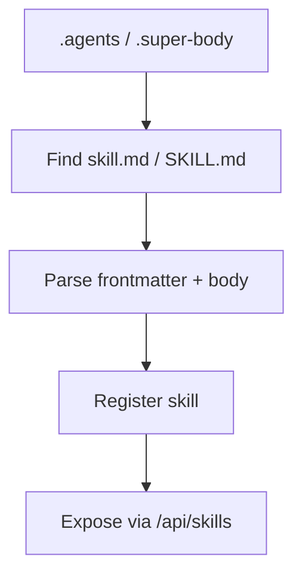

# Super Body

`super-body` is a local-first personal AI assistant skeleton inspired by
OpenClaw. The project is intentionally split into small packages so the control
plane, runtime, tools, sessions, runs, events, skills, and policy layers remain
explicit.

This document explains the current runtime flow from a user prompt to a final
assistant response, including how tool calls are decided and executed.

## High-Level Architecture



## Current Package Map

- `packages/core`: shared schemas and cross-package contracts
- `packages/agent`: direct-answer agent and tool-capable agent
- `packages/tools`: tool registry, tool contracts, built-in tools
- `packages/llm`: model-provider abstraction and OpenAI client
- `packages/memory`: persistent working memory store
- `packages/session`: session and transcript persistence
- `packages/runs`: run persistence
- `packages/events`: run event persistence
- `packages/skills`: skill discovery and registry
- `packages/policy`: execution-boundary decisions
- `apps/gateway`: HTTP control plane
- `apps/web`: debug-oriented frontend

## End-to-End Flow

## 1. User Sends a Prompt

The main entrypoint is the Web UI. The frontend sends a request to:

- `POST /api/chat`

Payload shape:

```json
{
  "text": "search the web for latest OpenAI news",
  "sessionId": "optional-existing-session-id"
}
```

The request contract lives in `packages/core/src/contracts.ts`.

---

## 2. Gateway Creates or Reuses a Session

The gateway is the orchestration entrypoint. In `apps/gateway/src/index.ts`,
the chat route:

- validates the request
- loads or creates a `sessionId`
- appends the user message to the session transcript

Session persistence is handled by:

- `packages/session/src/fileSessionStore.ts`

Each session is stored as a JSON document under:

- `workspace/sessions/<sessionId>.json`

---

## 3. Gateway Creates a Run

Every chat request becomes a `run`.

The gateway creates a run before agent execution:

- `packages/runs/src/fileRunStore.ts`

Each run is stored under:

- `workspace/runs/<runId>.json`

Runs track:

- `sessionId`
- `status`
- `input`
- `output`
- `error`
- timestamps

This makes each assistant execution a first-class control-plane unit instead of
just a transient HTTP request.

---

## 4. Gateway Starts an Event Timeline

The gateway writes run-scoped events such as:

- `run.started`
- `message.user`
- `agent.started`
- `message.assistant`
- `run.completed`
- `run.failed`

Event storage lives in:

- `packages/events/src/fileRunEventsStore.ts`

Each run's events are stored under:

- `workspace/events/<runId>.json`

This gives the system a traceable execution timeline.

---

## 5. Gateway Assembles Runtime Context

Before the agent runs, the gateway prepares the runtime context:

- current user message
- current `memory.md`
- current session transcript
- current runtime config

The orchestration handoff happens in:

- `apps/gateway/src/chatRuntime.ts`

At this point, the system has enough context to answer directly or use tools.

---

## 6. Agent Receives Structured Input

The agent does not receive a raw string. It receives `AgentRunInput`, which
currently includes:

- `message`
- `memory`
- `transcript`

The base interface is defined in:

- `packages/agent/src/baseAgent.ts`

Two agent modes currently exist:

- `SkeletonAgent`: fallback if no model key exists
- `ToolAgent`: main execution-oriented runtime

The tool-capable runtime lives in:

- `packages/agent/src/toolAgent.ts`

---

## 7. Prompt Construction

The agent builds a prompt from three main sources:

- working memory (`memory.md`)
- recent session transcript
- current incoming user message

If the tool-capable agent is active, it also includes:

- available tools
- tool-call output protocol

The current tool-call protocol is intentionally simple: the model may return
plain text or emit JSON shaped like:

```json
{
  "type": "tool_call",
  "toolName": "web_search",
  "arguments": {
    "query": "latest OpenAI news"
  }
}
```

This JSON is parsed by:

- `packages/agent/src/toolProtocol.ts`

---

## 8. LLM Decides: Reply Directly or Call a Tool

The model call is routed through:

- `packages/llm/src/openaiResponsesClient.ts`

The agent inspects the model output:

- if it is plain text, that becomes the assistant reply
- if it is a valid tool call, the runtime attempts tool execution

This is the point where the system shifts from "chatbot" to "assistant runtime".



---

## 9. Policy Checks Whether the Tool May Run

Before the tool executes, the system asks the policy layer for a decision.

Policy contracts live in:

- `packages/core/src/policy.ts`

Default decision logic lives in:

- `packages/policy/src/defaultPolicyEngine.ts`

Current default policy:

- `read` tools: auto allowed
- `write` tools: require confirmation
- `sensitive` tools: blocked

Tool risk levels are declared directly on tool definitions in:

- `packages/tools/src/types.ts`

So the flow becomes:



---

## 10. Tool Registry Executes the Tool

If policy allows the call, the tool runtime takes over.

Tool execution is handled by:

- `packages/tools/src/registry.ts`

The registry:

- looks up the tool by name
- validates input with the tool schema
- enforces timeout
- executes the tool
- returns a normalized `ToolResult`

Current built-in tools include:

- `echo`
- `web_search`
- `fetch_url`

Examples:

- `web_search` uses search-provider logic
- `fetch_url` fetches and normalizes page content

---

## 11. Agent Uses Tool Output to Produce the Final Reply

After a tool runs, the tool-capable agent makes one more model call using:

- the original message
- memory
- the tool result

The final reply is then returned to the gateway.

The current implementation intentionally limits tool use to a tightly bounded
loop to avoid uncontrolled execution.

---

## 12. Memory Is Updated

After the agent finishes, the chat runtime applies the deterministic memory
policy:

- `packages/agent/src/memoryPolicy.ts`

That policy decides what belongs in:

- `Preferences`
- `Facts`
- `Open Loops`
- `Recent Interactions`

The actual write is performed by:

- `packages/memory/src/fileMemoryStore.ts`

This keeps "what to remember" separate from "how memory is stored".

---

## 13. Session, Run, and Event Records Are Finalized

After the assistant reply is available, the gateway:

- appends the assistant message to the session transcript
- updates the run to `completed` or `failed`
- appends final run events
- returns the HTTP response

The chat response currently includes:

- `reply`
- `memoryUpdated`
- `sessionId`
- `runId`

This lets the UI track both conversational and execution identity.

---

## 14. Web UI Displays Control-Plane State

The web app currently exposes multiple debug-oriented panels:

- gateway state
- chat
- tools
- skills
- runs
- run events
- config

This is intentional: the UI currently functions more like a control-plane
console than a polished consumer app.

---

## Skill Discovery Flow

Skills are discovered from:

- `.agents/`
- `.super-body/`

Only markdown files are treated as skill definitions:

- `SKILL.md`
- `skill.md`

Skill discovery is handled by:

- `packages/skills/src/discovery.ts`
- `packages/skills/src/parsers/parseMarkdownSkill.ts`

Each skill must contain frontmatter plus markdown body. This means a skill is
not just metadata; it also carries natural-language guidance for future runtime
activation.



## Current Limitations

This project already has many OpenClaw-inspired layers, but some important
runtime layers are still skeletal:

- channels are not abstracted yet
- skill runtime activation is not implemented
- policy is not yet integrated with skills or channels
- tool-level events are not yet emitted into the event timeline
- artifacts are not yet first-class records
- orchestrator logic still lives mostly in the agent and gateway

## Summary

The current system flow is:

1. user prompt enters via web
2. gateway creates or reuses a session
3. gateway creates a run
4. gateway writes run events
5. gateway assembles memory + transcript + message
6. agent builds a prompt
7. model decides direct reply or tool call
8. policy decides whether tool execution is allowed
9. tool registry executes if allowed
10. agent turns tool output into final reply
11. memory is updated
12. session, run, and event records are finalized
13. web displays reply plus control-plane state

This gives the project a clear control-plane skeleton rather than a single
chat-response loop.
