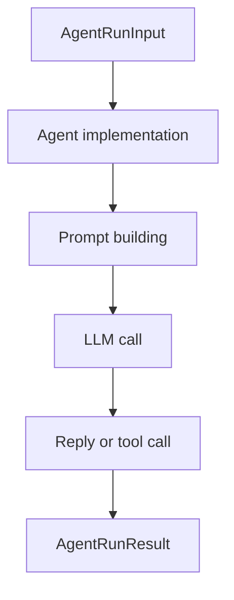

# Agent Package

## Purpose

`@repo/agent` contains the assistant runtime entrypoints. It converts structured
inputs into replies and coordinates prompt construction for both direct-answer
and tool-using agents.

## Responsibilities

- Define the common `Agent` interface
- Provide a fallback `SkeletonAgent`
- Provide `LlmAgent` for plain LLM replies
- Provide `ToolAgent` for tool-aware replies
- Build memory-aware prompts
- Apply memory extraction heuristics through `memoryPolicy`

## Key Files

- `src/baseAgent.ts`: base interface and fallback agent
- `src/llmAgent.ts`: plain LLM agent
- `src/toolAgent.ts`: tool-capable agent
- `src/toolCatalog.ts`: renders available tools into prompt text
- `src/toolProtocol.ts`: parses model-emitted tool-call JSON
- `src/memoryPolicy.ts`: deterministic memory patch policy

## Boundaries

- This package does not persist sessions, runs, or events
- This package does not write to storage directly
- This package does not decide final execution policy; it consumes a policy engine

## Flow

## Notes

- `ToolAgent` is currently the main execution-oriented agent
- Prompt composition is still local to each agent file and can be centralized later
