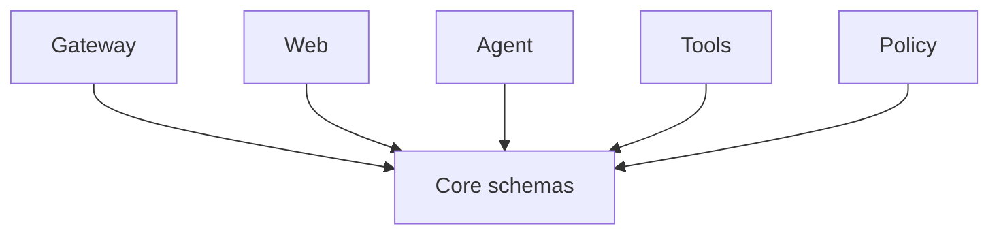

# Core Package

## Purpose

`@repo/core` is the shared schema and contract package. It defines the canonical
types used across gateway, web, agents, tools, sessions, runs, events, skills,
and policy.

## Responsibilities

- Define shared Zod schemas
- Define API request/response contracts
- Define cross-package domain types
- Act as the single source of truth for runtime validation

## Key Files

- `src/contracts.ts`: chat, tool-view, and agent runtime contracts
- `src/config.ts`: assistant config and runtime config schema
- `src/session.ts`: session and transcript schema
- `src/runs.ts`: run schema
- `src/events.ts`: run-event schema
- `src/skills.ts`: skill manifest schema
- `src/policy.ts`: policy contracts

## Boundaries

- This package contains no business logic
- This package should avoid package-specific runtime code
- Every other package should prefer importing shared contracts from here

## Flow

## Notes

- If a field is shared across packages, define it here first
- Avoid duplicate schemas in feature packages
