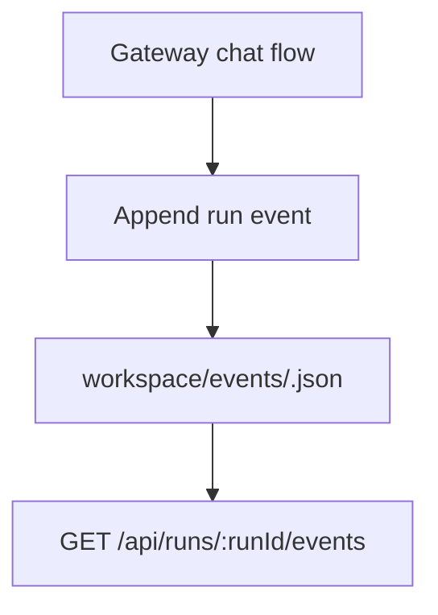

# Events Package

## Purpose

`@repo/events` stores run-level event streams. It gives each run an observable
execution timeline instead of leaving execution as a black box.

## Responsibilities

- Append run events
- List events for a given run
- Persist run-event timelines to local files

## Key Files

- `src/fileRunEventsStore.ts`: file-backed run-event store
- `src/index.ts`: public exports

## Boundaries

- This package does not create runs
- This package does not interpret events semantically
- This package only stores and retrieves ordered event records

## Flow

## Notes

- Current events are coarse-grained and sufficient for control-plane visibility
- Tool-level traces can later hang off this package without changing run storage
