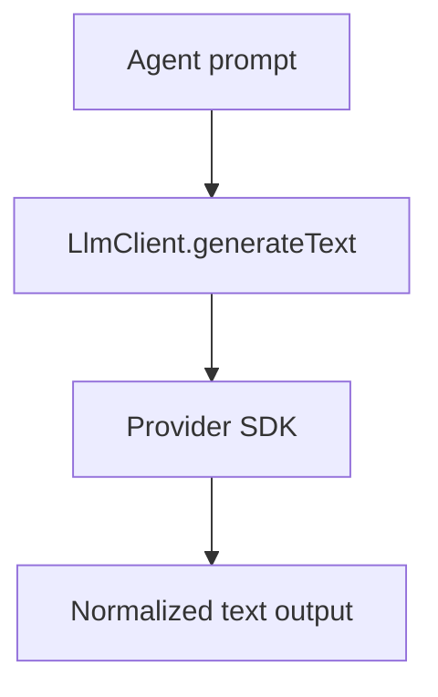

# LLM Package

## Purpose

`@repo/llm` isolates model-provider access behind a small interface. It keeps
vendor SDK usage out of the agent and gateway packages.

## Responsibilities

- Define the `LlmClient` abstraction
- Implement the OpenAI Responses client
- Normalize text generation calls

## Key Files

- `src/types.ts`: LLM client interface
- `src/openaiResponsesClient.ts`: OpenAI implementation
- `src/index.ts`: exports

## Boundaries

- This package does not build prompts
- This package does not manage tools, runs, or sessions
- This package only talks to model providers

## Flow

## Notes

- New providers should implement the same interface instead of changing agent code
