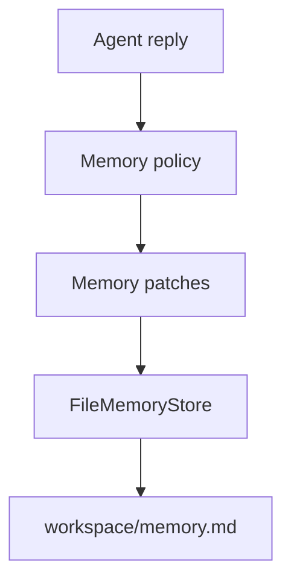

# Memory Package

## Purpose

`@repo/memory` manages persistent assistant memory. The current implementation
uses a markdown document as the working memory store.

## Responsibilities

- Initialize `memory.md`
- Read current memory content
- Apply structured memory patches into fixed sections

## Key Files

- `src/fileMemoryStore.ts`: file-backed memory store
- `src/fileMemoryStore.test.ts`: store behavior tests
- `src/index.ts`: exports

## Boundaries

- This package does not decide what to remember
- Memory policy belongs to `@repo/agent`
- This package only persists already-decided memory updates

## Flow

## Notes

- The current store is intentionally simple and human-readable
- Long-term memory and retrieval can later be added as separate layers
