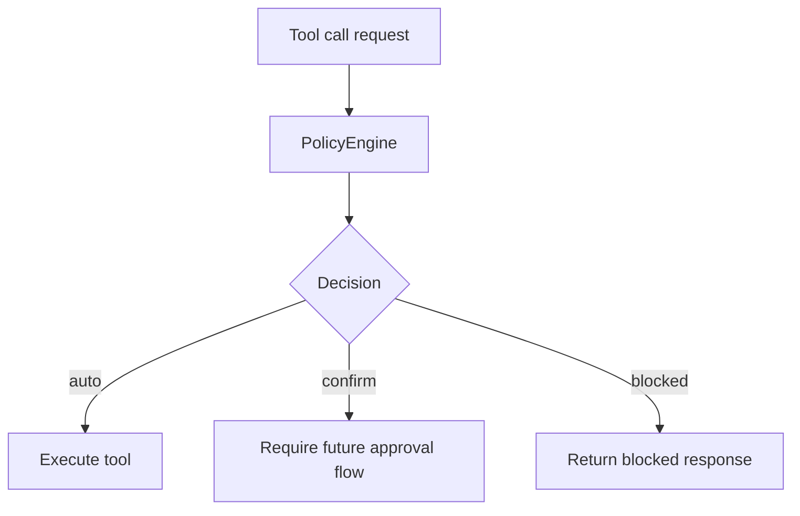

# Policy Package

## Purpose

`@repo/policy` defines the execution-boundary layer. It decides whether a tool
may run automatically, requires confirmation, or must be blocked.

## Responsibilities

- Define the `PolicyEngine` interface
- Provide a default execution policy
- Convert tool risk levels into execution decisions

## Key Files

- `src/defaultPolicyEngine.ts`: default policy engine and interface
- `src/index.ts`: exports

## Boundaries

- This package does not execute tools
- This package does not own UI confirmation flows
- This package only makes decisions; other layers enforce them

## Flow

## Notes

- Current default policy is intentionally conservative
- Skill-aware and channel-aware policy can later extend the same interface
