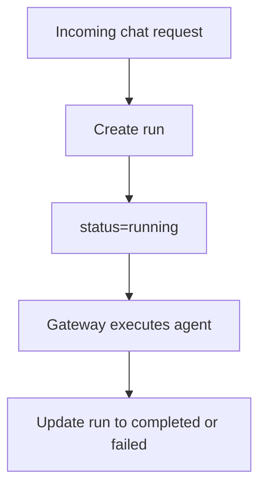

# Runs Package

## Purpose

`@repo/runs` stores execution units. A run represents one assistant execution
attempt within a session and acts as the main control-plane record.

## Responsibilities

- Create runs
- Read runs
- List runs
- Update run status, output, and error fields

## Key Files

- `src/fileRunStore.ts`: file-backed run store
- `src/index.ts`: exports

## Boundaries

- This package does not store event timelines
- This package does not store sessions
- This package only manages the run record itself

## Flow

## Notes

- Runs are the anchor for later tracing, artifacts, and background execution
