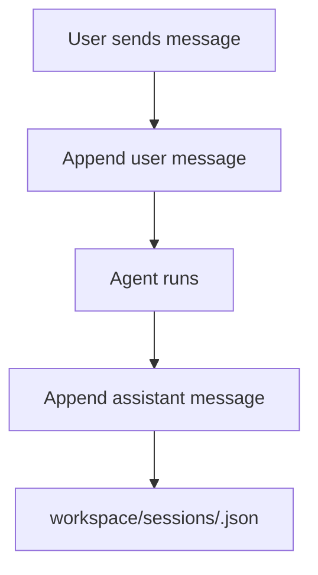

# Session Package

## Purpose

`@repo/session` manages conversation containers. A session groups user and
assistant messages and provides the transcript context used by the agent.

## Responsibilities

- Create sessions
- List sessions
- Read session transcripts
- Append transcript messages

## Key Files

- `src/fileSessionStore.ts`: file-backed session store
- `src/index.ts`: exports

## Boundaries

- This package does not run the agent
- This package does not store memory or runs
- This package only owns conversation transcript persistence

## Flow

## Notes

- Transcript context is intentionally separate from working memory
- Future session metadata can grow here without changing run storage
