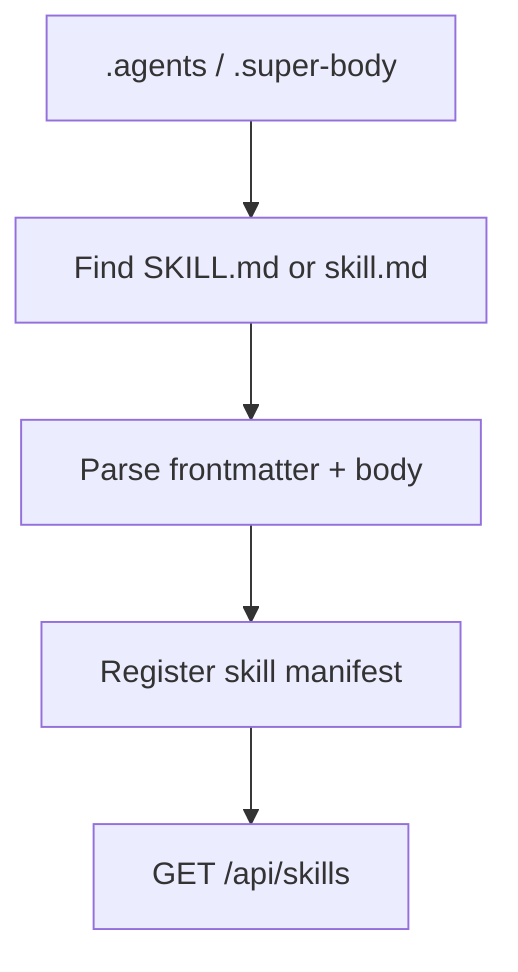

# Skills Package

## Purpose

`@repo/skills` discovers and registers assistant skills from markdown files.
It gives the system a modular capability layer above raw tools.

## Responsibilities

- Discover skill files from configured roots
- Parse markdown skill manifests with frontmatter
- Register discovered skills
- Provide a list/get registry interface

## Key Files

- `src/discovery.ts`: filesystem-based skill discovery
- `src/parsers/parseMarkdownSkill.ts`: markdown skill parser
- `src/registry.ts`: in-memory skill registry
- `src/types.ts`: type re-exports

## Boundaries

- This package does not execute skills
- This package does not inject skill prompts into agents yet
- This package only discovers and indexes skill definitions

## Flow

## Notes

- Markdown is the canonical skill format
- Skill runtime activation is a later layer, separate from discovery
