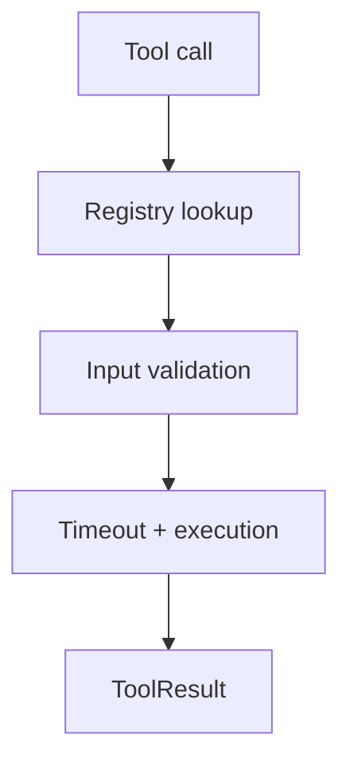

# Tools Package

## Purpose

`@repo/tools` provides the executable capability layer. It defines tool
contracts, runtime registration, execution behavior, and the first concrete
read-only tools.

## Responsibilities

- Define the `Tool` interface
- Register tools
- Validate tool arguments
- Execute tools with timeout/error handling
- Provide built-in tools such as `echo`, `web_search`, and `fetch_url`

## Key Files

- `src/types.ts`: tool contracts
- `src/registry.ts`: tool registry and execution flow
- `src/errors.ts`: tool-specific errors
- `src/builtins/*`: built-in tool implementations
- `src/search/*`: search provider layer
- `src/fetch/*`: URL fetch provider layer

## Boundaries

- This package does not decide when to call a tool
- Tool selection belongs to the agent layer
- Policy decides whether a tool may execute automatically

## Flow

## Notes

- Tools carry a `riskLevel` so policy can gate execution
- The current toolset is intentionally read-only
